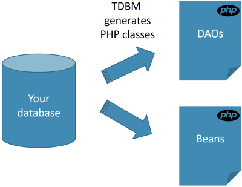
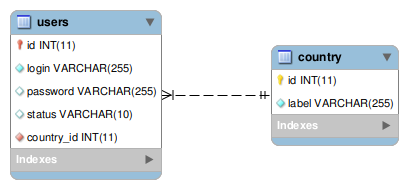
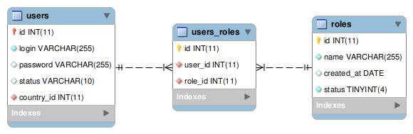
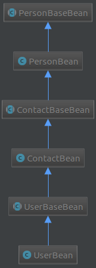

[](https://packagist.org/packages/thecodingmachine/tdbm)
[](https://packagist.org/packages/thecodingmachine/tdbm)
[](https://packagist.org/packages/thecodingmachine/tdbm)
[](https://packagist.org/packages/thecodingmachine/tdbm)
[](https://scrutinizer-ci.com/g/thecodingmachine/tdbm/?branch=5.0)
[](https://travis-ci.org/thecodingmachine/tdbm)
[](https://coveralls.io/github/thecodingmachine/tdbm?branch=5.0)


About TDBM (The DataBase Machine)
=================================

What is it?
-----------

THE DATABASE MACHINE (TDBM) is a PHP library designed to ease your access to your database.

The goal behind TDBM is to make database access as easy as possible. Users should access their objects easily, and store those objects as easily.

Design philosophy
-----------------

TDBM is an opiniated ORM. It will not suit everybody and all needs. Here is what you need to know.

## TDBM starts with your database model and generates PHP files

TDBM is a "database first" ORM. Everything starts from your database. TDBM is very good at understanding your database model and the intent behind it. It will generate PHP objects mapping your model.



TDBM **understands your database model**. From it, it will generate PHP classes that will help you access your database:
 
 - *DAOs* that are services helping you access a given table
 - and *Beans* that are classes representing a row in your database.

```php
// Daos are used to query the database
$user = $userDao->getById(42);

// Beans have getters and setters for each column
$login = $user->getLogin();
```

Because PHP objects are generated (no magic properties), you get a nice **autocompletion** in your favorite IDE (PHPStorm, Eclipse PDT, Netbeans...).

## TDBM is really good at understanding your database model

TDBM has one of **the most powerful database model analyzer** out there.

### TDBM relies on your foreign keys

TDBM analyzes your foreign key and turns them into getters and setters.



```php
// Let's get the name of the country of the current user
$user->getCountry()->getName();

// Let's get all users in a given country
$users = $country->getUsers();
```

### TDBM can detect pivot table

TDBM can automatically detect pivot tables to generate **many to many relationships**.



```php
// Let's directly access the list of roles from a user
$roles = $user->getRoles();

// Let's set all the roles at once
$user->setRoles($roles);

// Or one by one
$user->addRole($role);

$user->removeRole($role);
```

### TDBM understands inheritance

TDBM can understand typical ways of representing inheritance in a SQL database (primary keys being also foreign keys)...


... and turn it into real OO inheritance!



## Simplicity first

TDBM is meant to be easy to use and non obtrusive.

**Making simple tasks should be simple.** TDBM does not cover everything you can do with a complete ORM system. 
But it makes as simple as possible those tasks you do 80% of the time. For the remaining 20% (like performance critical requests, and so on), you can use SQL.
For instance, TDBM has a **unique feature that guesses jointures for you**. No need to write joins anymore!

## Based on Doctrine DBAL

TDBM uses the hugely popular Doctrine database abstraction layer for low level database access. It allows compatibility with a very wide range of databases.

## No configuration

There is no configuration needed for TDBM. TDBM needs a DBAL database connection and a Doctrine cache. That's it!

Ready to dive in? Let's get started!

- [Install TDBM](doc/install.md)
- [Access the database, perform queries, inserts and updates](doc/quickstart.md)
- [Add limit and offsets to your queries](doc/limit_offset_resultset.md)
- [Regenerating DAOs and beans](doc/generating_daos.md)
- [Modeling inheritance](doc/modeling_inheritance.md)
- [Improving memory usage](doc/memory_management.md)
- [A quick comparison with Doctrine](doc/comparison_with_doctrine.md)
- [TDBM internals](doc/internals.md)
