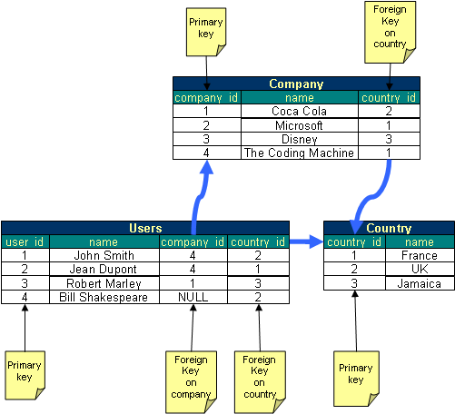
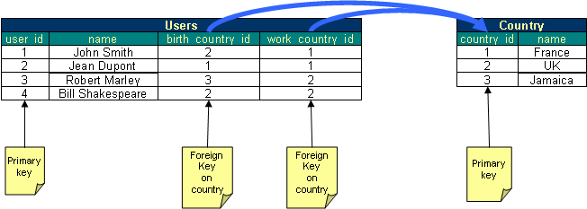
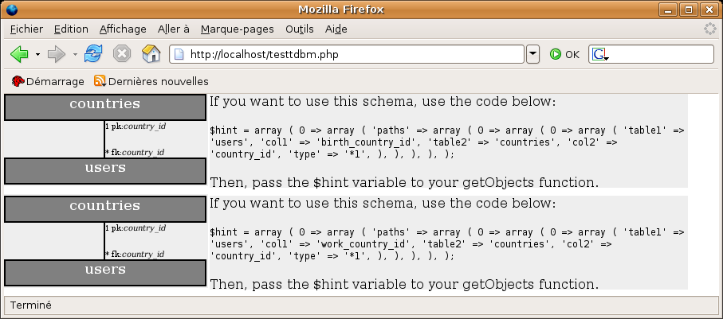

Advanced tutorial
=================

In this advanced tutorial, we will learn how to use the getObjects method in details, and see the behaviour of TDBM with more complex data model.
If you are new to TDBM, you should start with the <a href="quickstart.html">quickstart guide</a>.

Making complex queries: the getObjects method
---------------------------------------------

Complex queries with filters and ordering is achieved in TDBM through the <code>xxxDao::getXxxListByFilter</code> protected method.

```php
protected function getXxxListByFilter($filterBag=null, $orderbyBag=null, $from=null, $limit=null);
```

The getXxxListByFilter method should be the preferred way to perform queries in TDBM.  (Note: if you want to query the database for an object by its primary key, use the getXxxById method).
The getXxxListByFilter method takes in parameter: 
- filter_bag (optionnal): The filter bag is anything that you can use to filter your request. It can be a SQL Where clause,	a series of DBM_Filter objects, or even DBM_Objects or DBM_ObjectArrays that you will use as filters.
- order_bag (optionnal): The order bag is what you use to order the results of your request. It can be a SQL OrderBy clause,	a series of DBM_OrderByColumn objects or an array containing both.
- from (optionnal): The offset from which the query should be performed. For instance, if $from=5, the getObjects method will return objects from the 6th row.
- limit (optionnal): The maximum number of objects returned. Together with the <code>from</code> parameter, this can be used to implement paging.


The getXxxListByFilter method will return a TDBM_ObjectArray. A TDBM_ObjectArray is an array of XxxBean that does behave as 
a single XxxBean if the array has only one member. Refer to the documentation of TDBM_ObjectArray and TDBM_Object to learn more.

###More about the filter bag

A filter is anything that can change the set of objects returned by getXxxListByFilter. 
There are many kind of filters in TDBM: A filter can be: 

- A SQL WHERE clause:
  The clause is specified without the "WHERE" keyword. For instance:  
  <pre class="brush:php">$filter = "users.first_name LIKE 'J%'";</pre>
  is a valid filter. 
  The only difference with SQL is that when you specify a column name, it should always be fully qualified with the table name: "country_name='France'" is not valid, while "countries.country_name='France'" is valid (if  		"countries" is a table and "country_name" a column in that table, sure.  		For instance,  				$french_users = DBM_Object::getObjects("users", "countries.country_name='France'");  		will return all the users that are French (based on trhe assumption that TDBM can find a way to connect the users  		table to the country table using foreign keys, see the manual for that point). - A DBM_Object:
  An object can be used as a filter. 
  For instance, we could get the France object and then find any users related to that object using:
  ```php
  // In the CountryDao
  $france = $this-&gt;getCountryListByFilter("countries.country_name='France'");
  // In the UserDao
  $french_users = $this-&gt;getUserListByFilter($france);
  ```

- A DBM_ObjectArray can be used as a filter too.
<pre class="brush:php">$french_groups = $this-&gt;getGroupListByFilter("groups", $french_users);</pre>
This sample will return all the groups in which french users can be found.

- Finally, TDBM_xxxFilter instances can be used.
TDBM provides the developer a set of TDBM_xxxFilters that can be used to model a SQL Where query. Using the appropriate filter object, you can model the operations =,&lt;,&lt;=,&gt;,&gt;=,IN,LIKE,AND,OR, IS NULL and NOT.
For instance:
<pre class="brush:php">$french_users = $this-&gt;getUserListByFilter(new TDBM_EqualFilter('countries','country_name','France'));</pre>
Refer to the documentation of the appropriate filters for more information.


The nice thing about a filter bag is that it can be any filter, or any array of filters.
In that case, filters are  'ANDed' together.  So a request like this is valid:
<pre class="brush:php">
// In the country Dao
$france = $this-&gt;getCountryByFilter("countries.country_name='France'");
// In the users Dao
$french_administrators = $this-&gt;getUserListByFilter(array($france,"role.role_name='Administrators'"));
</pre>

This requests would return the users that are both French and administrators.

Finally, if filter_bag is null, the whole table is returned.


###More about the order bag

The order bag contains anything that can be used to order the data that is passed back to you. 
The order bag can contain two kinds of objects: 


- A SQL ORDER BY clause:
The clause is specified without the "ORDER BY" keyword. For instance:
<pre class="brush:php">$orderby = "users.last_name ASC, users.first_name ASC";</pre>
The only difference with SQL is that when you specify a column name, it should always be fully qualified with the table name: <code>"country_name ASC"</code> is not valid, while <code>"countries.country_name ASC"</code> is valid (if "countries" is a table and "country_name" a column in that table, sure.
<pre class="brush:php">$users = $this-&gt;getUserListByFilter(null, "countries.country_name ASC");</pre>
This will return all the users sorted by country.
- A TDBM_OrderByColumn object.
This object models a single column in a database.
<pre class="brush:php">$users = $this-&gt;getUserListByFilter(null, new TDBM_OrderByColumn("country", "country_name", "ASC");</pre>
	
About ambiguity
---------------

In the samples of the quick start guide, everything happens to be fine because the object model is quite simple. In 80% of the cases you will encounter, you will be able to stick to the access model presented in the quick start guide. There are, however, cases where there could be several ways to join two tables, as shown below.


In the example above, we added a company table. A company is attached to a country. A user is attached to a company, and still, a user is attached to a country (for instance, its birth place). Therefore, a user can be attached to a country that is different from the country of its company.

Now, what if we write this piece of code:

<pre class="brush:php">$user = $userDao-&gt;getUserById(1);
$country = $user-&gt;getCountry();
echo $country-&gt;getName();</pre>

Will we get the country of user 1 (UK) or will we get the country of the company for which user 1 is working for (France)? The code above is to some extent ambiguous. How will TDBM decide?
The answer lies in the first design choice of TDBM: _Simplicity_. TDBM will choose the simplest way to go because it is likely that this is what the developer meant. Here, obiously, the developer certainly meant that he wanted the country of the user, so this is what he will get.
For TDBM, the simplest way is the way that requires the less joins between tables to get to the result.

This rule works for most of the problems you will encounter. However, there are still cases where ambiguity can happen, and cannot be resolved by TDBM. Have a look at the schema below:


In this schema, a user is linked to 2 countries. One is its birth country and one is the country he works in. Here, TDBM cannot make any decision... If the user writes

<code>$country = $userBean-&gt;getCountry();</code>
there is no way to know if it more likely that he wanted the birth country or the work country. So TDBM will throw an ambiguity exception. This exception will inform the user that its request is ambiguous and that he should solve it. Below is the exception the user will get:
<code>
Uncaught exception 'DB_AmbiguityException' with message 'An ambiguity has been found during the search. Please catch this exception and execute the $exception-&gt;explainAmbiguity() to get a nice graphical view of what you should do to solve this ambiguity.The table 'users' can be reached using several different ways from the table 'countries'.

Solution 1:
Table 'countries' is pointed by 'users' through its foreign key 'birth_country_id'

Solution 2:
Table 'countries' is pointed by 'users' through its foreign key 'work_country_id'
</code>
This exception message is quite clear on the ambiguity. However, on big data models, the message might get long enough, with a lot of possible ambiguities. TDBM offers you a nice graphical view of ambiguities (if you are in an HTML page, which is likely since we are using PHP). For this, just follow the steps in the exception message. It informs us that we should catch the exception and use the <code>$exception-&gt;explainAmbiguity();</code> function. Let's do that.


<code>
$user = TDBM_Object::getObject('users',1);
try {
	$country = $user-&gt;get_countries();
} catch (DB_AmbiguityException $ex) {
	$ex-&gt;explainAmbiguity();
}
</code>


By running the code, we get this display in our browser:

We get a graphical view of the ambiguity. TDBM also proposes you a way of sorting this ambiguity.
